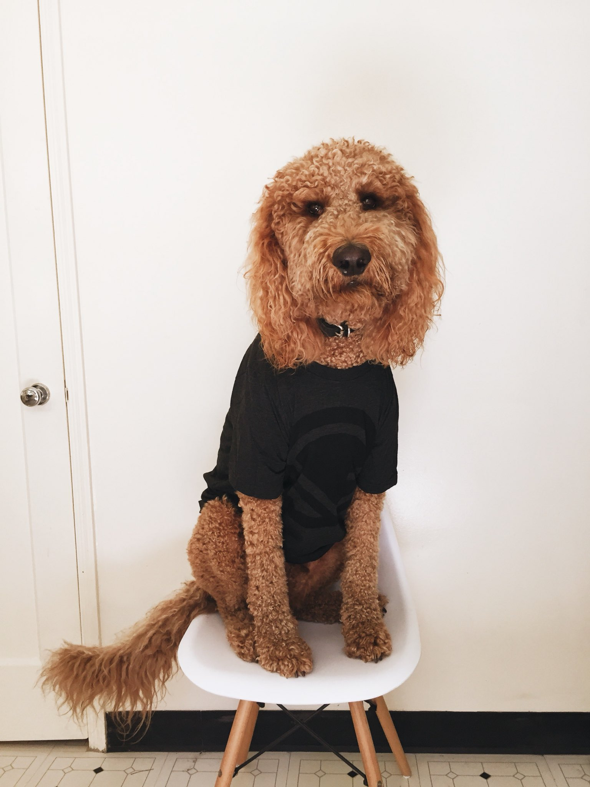

Gatsby source plugin for pulling data into Gatsby from [Dog API](https://dog.ceo/dog-api)



## Documentation

For a detailed explanation of the API, please read through the [documentation page](/doc)

## Quick Start

### Installation

```
$ yarn add gatsby-source-dog
```

You are probably using these plugins already, but just in case you didn't:

```
$ yarn add gatsby-plugin-sharp gatsby-transformer-sharp
```

If you are wondering, I have a post explaining why we want to use these 2 extra plugins: [Other plugins integration](/other-plugins-integration)

### Config

Inside your `gatsby-config.js`

```javascript
// gatsby-config.js:

{
  ...
  plugins: [
    ...
    {
    resolve: "gatsby-source-dog",
    options: {
      breeds: {
        list: true,
        random: true,
        number: 5,
      },
      breed: [
        "husky",
        "Border Collie",
        "retriever-golden",
        {
          name: "corgi",
        },
        {
          name: "Great Dane",
          random: true,
        },
        {
          name: "pug",
          random: true,
          number: 3,
        },
      ],
    },
    ...
  ],
  ...
}
```

### Query

In this page, I randomly display a dog image. Here is how I did it:

1.  Get all dog images
2.  Randomly select one image

```jsx
// src/pages/index.js

<StaticQuery
  query={graphql`
    {
      allDogImage {
        edges {
          node {
            url
          }
        }
      }
    }
  `}
  render={data => {
    const imgArr = data.allDogImage.edges
    const randomURL = imgArr[Math.floor(Math.random() * imgArr.length)].node.url
    return <IndexPage imgURL={randomURL} {...props} />
  }}
/>
```

For more examples, please check out:

- Example 1
- Example 2
- Example 3
